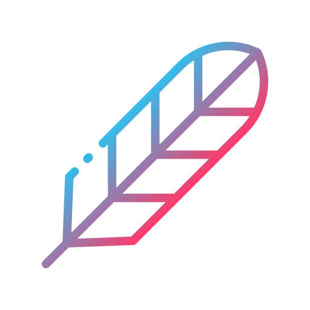

<!-- Improved compatibility of back to top link: See: https://github.com/othneildrew/Best-README-Template/pull/73 -->
<a name="readme-top"></a>
<!--
*** Thanks for checking out the Best-README-Template. If you have a suggestion
*** that would make this better, please fork the repo and create a pull request
*** or simply open an issue with the tag "enhancement".
*** Don't forget to give the project a star!
*** Thanks again! Now go create something AMAZING! :D
-->


<!-- PROJECT SHIELDS -->
<!--
*** I'm using markdown "reference style" links for readability.
*** Reference links are enclosed in brackets [ ] instead of parentheses ( ).
*** See the bottom of this document for the declaration of the reference variables
*** for contributors-url, forks-url, etc. This is an optional, concise syntax you may use.
*** https://www.markdownguide.org/basic-syntax/#reference-style-links
-->


<!-- PROJECT LOGO -->

<div align="left">
<h1> DutchScript</h1>
  <p>
    DutchScript is a fun programming language dedicated to learn young dutch kids programming in their native language.
    <br />
    <a href="https://github.com/howtoprogrambirds/DutchScript/tree/main/documentation"><strong>Explore the docs »</strong></a>
    <br />
    <br />
    <a href="#usage">View Demo</a>
    ·
    <a href="https://github.com/howtoprogrambirds/DutchScript/issues">Report Bug</a>
    ·
    <a href="https://github.com/howtoprogrambirds/DutchScript/issues">Request Feature</a>
  </p>
</div>

[![Contributors][contributors-shield]][contributors-url]
[![Forks][forks-shield]][forks-url]
[![Stargazers][stars-shield]][stars-url]
[![Issues][issues-shield]][issues-url]
[![LinkedIn][linkedin-shield]][linkedin-url]


<div align="left">
  <h2>Table of Contents</h2>
  <ol>
    <li>
      <a href="#about-the-project">About The Project</a>
      <ul>
        <li><a href="#built-with">Built With</a></li>
      </ul>
    </li>
    <li>
      <a href="#getting-started">Getting Started</a>
      <ul>
<!--         <li><a href="#prerequisites">Prerequisites</a></li> -->
        <li><a href="#installation">Installation</a></li>
      </ul>
    </li>
    <li><a href="#usage">Usage</a></li>
    <li><a href="#roadmap">Roadmap</a></li>
    <li><a href="#requirements">Requirements</a></li>
    <li><a href="#contributing">Contributing</a></li>
    <li><a href="#license">License</a></li>
    <li><a href="#contact">Contact</a></li>
    <li><a href="#acknowledgments">Acknowledgments</a></li>
  </ol>


<!-- ABOUT THE PROJECT -->
## About The Project
  
<!--  -->

<!-- [![Product Name Screen Shot][product-screenshot]](https://example.com) -->

The main goal of the project is: to create an interpreter and compiler.

<p align="right">(<a href="#readme-top">back to top</a>)</p>


### Built With

   

<p align="right">(<a href="#readme-top">back to top</a>)</p>


<!-- GETTING STARTED -->
## Getting Started
<!-- 
This is an example of how you may give instructions on setting up your project locally.
To get a local copy up and running follow these simple example steps. -->

<!-- ### Prerequisites -->

### Installation

1. Clone the repo
   ```sh
   git clone https://github.com/howtoprogrambirds/Dutchscript.git
   ```
<p align="right">(<a href="#readme-top">back to top</a>)</p>


<!-- USAGE EXAMPLES -->
## Usage
  
To run the code, you would have to run the cli.py file. Here by running the cli.py file, you can pass the source file and the values of the arguments of your "Begin" function.
  
As an example, I have created double recursion functions (in the examples folder with other examples, if you want to make your own just add a new file to the example folder. For more information about the DutchScript language itself, <a href="https://github.com/howtoprogrambirds/DutchScript/tree/main/documentation"><strong>explore the docs</strong></a>). See below:
```
Bekijk de evenheidstest 'een n':
	als een n kleiner 0 :
	    als een n hetzelfde 0 :
	        Geef waarheid .
	    !
	    anders :
	        Geef leugen .
	    !
	!
	anders :
		Geef de evenheidstest 'een n - 2 '.
	!
!

Bekijk de onevenheidstest met 'een m':
	als een m kleiner 1 :
		als een m hetzelfde 1 :
	        Geef waarheid .
	    !
	    anders :
	        Geef leugen .
	    !
	!
	anders :
		Geef de onevenheidstest 'een m - 2 '.
	!
!


Bekijk het Begin'een n, een m':
    de resultaatEen is Roep een evenheidstest 'een n'.
    Zeg "resultaat 1 terug: ", de resultaatEen.

    de resultaatTwee is Roep een onevenheidstest 'een m'.
    Zeg "resultaat 2 terug: ", de resultaatTwee.
    Geef de resultaatTwee.
!
```

To run this code, you would run this command in the terminal. For this example, argument values 2 and 3 are given (if there are more or less, you have to add the **"--arguments"** flag to it). You can, of course, change these values.
  
```
[your desktop path]/src/CommandLineInterface$ python3 cli.py --filename="double_recursive" --arguments=2 --arguments=3
```
  
Which will give this output:
```
resultaat 1 terug: waarheid
resultaat 2 terug: waarheid
waarheid

```
<!-- Use this space to show useful examples of how a project can be used. Additional screenshots, code examples and demos work well in this space. You may also link to more resources.

_For more examples, please refer to the [Documentation](https://example.com)_ -->

<p align="right">(<a href="#readme-top">back to top</a>)</p>


<!-- ROADMAP -->
## Roadmap

- [ ] Lexer
- [ ] Parser (can't parse classes)
- [ ] Interpreter (can't interpret classes)

See the [open issues](https://github.com/howtoprogrambirds/DutchScript/issues) for a full list of proposed features (and known issues).

<p align="right">(<a href="#readme-top">back to top</a>)</p>


<!-- REQUIREMENTS -->
## Requirements
- [ ] Turing Complete
- [ ] Goto-statements 
- [ ] Loops 
- [ ] Object printing
- [ ] error handler 

### Interpreter-functionality
- [ ] One or more functies per file
- [ ] Function arguments pass through function call
- [ ] Recursive Function
- [ ] Function can call other functions
- [ ] Return value can be printed out

<!-- CONTRIBUTING -->
## Contributing

Contributions are what make the open source community such an amazing place to learn, inspire, and create. Any contributions you make are **greatly appreciated**.

If you have a suggestion that would make this better, please fork the repo and create a pull request. You can also simply open an issue with the tag "enhancement".
Don't forget to give the project a star! Thanks again!

1. Fork the Project
2. Create your Feature Branch (`git checkout -b feature/AmazingFeature`)
3. Commit your Changes (`git commit -m 'Add some AmazingFeature'`)
4. Push to the Branch (`git push origin feature/AmazingFeature`)
5. Open a Pull Request

<p align="right">(<a href="#readme-top">back to top</a>)</p>


<!-- LICENSE -->
## License

Distributed under the MIT License. See `LICENSE.txt` for more information.

<p align="right">(<a href="#readme-top">back to top</a>)</p>


<!-- CONTACT -->
## Contact

I used the rules of functional programming with this exercise, and I'm still learning!   
So if you have any comments on my code. Please let me know!
  
Dylan van Eck - dylananne_v_eck@gmail.com

Project Link: [https://github.com/howtoprogrambirds/Dutchscript](https://github.com/howtoprogrambirds/Dutchscript)

<p align="right">(<a href="#readme-top">back to top</a>)</p>


<!-- ACKNOWLEDGMENTS -->
## Acknowledgments

<a href="https://www.flaticon.com/free-icons/machine-learning" title="machine-learning icons"> Machine-learning icons (logo) created by Smashicons - Flaticon</a>

<p align="right">(<a href="#readme-top">back to top</a>)</p>


<!-- MARKDOWN LINKS & IMAGES -->
<!-- https://www.markdownguide.org/basic-syntax/#reference-style-links -->
[contributors-shield]: https://img.shields.io/github/contributors/howtoprogrambirds/DutchScript.svg?style=for-the-badge
[contributors-url]: https://github.com/howtoprogrambirds/DutchScript/graphs/contributors
[forks-shield]: https://img.shields.io/github/forks/howtoprogrambirds/DutchScript.svg?style=for-the-badge
[forks-url]: https://github.com/howtoprogrambirds/DutchScript/network/members
[stars-shield]: https://img.shields.io/github/stars/howtoprogrambirds/DutchScript.svg?style=for-the-badge
[stars-url]: https://github.com/howtoprogrambirds/DutchScript/stargazers
[issues-shield]: https://img.shields.io/github/issues/howtoprogrambirds/DutchScript.svg?style=for-the-badge
[issues-url]: https://github.com/howtoprogrambirds/DutchScript/issues
[license-shield]: https://img.shields.io/github/license/howtoprogrambirds/DutchScript.svg?style=for-the-badge
[license-url]: https://github.com/howtoprogrambirds/DutchScript/blob/master/LICENSE.txt
[linkedin-shield]: https://img.shields.io/badge/-LinkedIn-black.svg?style=for-the-badge&logo=linkedin&colorB=555
[linkedin-url]: https://linkedin.com/in/dylan-van-eck-16b50a183
[product-screenshot]: images/screenshot.png

